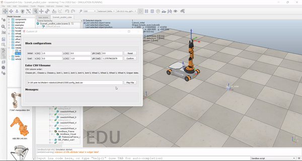
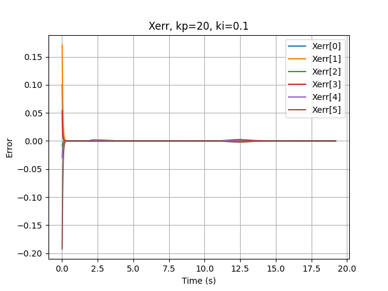

# Capstone Mobile Manipulation of KUKA YOUBOT

This project is based on the Capstone mobile manipulation project from coursera course of Modern Robotics.
For More Details you can refer the following link :
> http://hades.mech.northwestern.edu/index.php/Mobile_Manipulation_Capstone

This projects Covers following topics :

* Generate the kinematics simulator of the youBot - an omnidirectional mobile robot with a 5-DOF robotic arm.
* Plan the end-effector's trajectory between waypoints.
* Apply feedback control to drive the robot in the desired trajectory.
* Simulate the planned trajectory in CoppeliaSim.

# Instructions for usage
Run `main.py`  to generate:

   * A file contains the calculated trajectory for the end-effector : `trajectory_*your given name*.csv`

   * A file used to simulate the robot motion in *CoppeliaSim* : `config_*your given name*.csv`

   * A plot showing the change of error twist versus time and the data file : `Xerr_*your given name*.csv` 
  
  # Results 
  ## CoppeliaSim Animation for best PID controller kp = 20 and ki =0.1
  
   
  
  ## Xerror plot vs Time
  Xerror depends on values of Kp and Ki and can be minimized by choosing right Kp and Ki.
  
  Following Image shows Xerr VS time for the animation shown above
   
